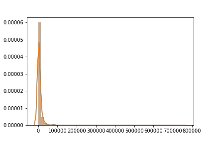
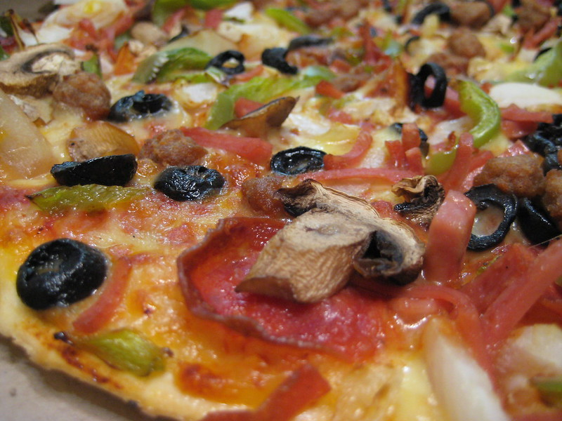
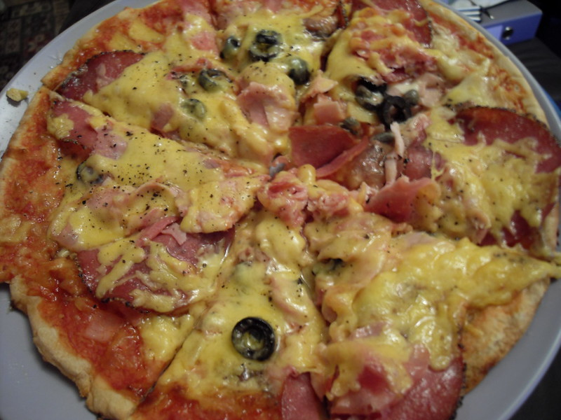
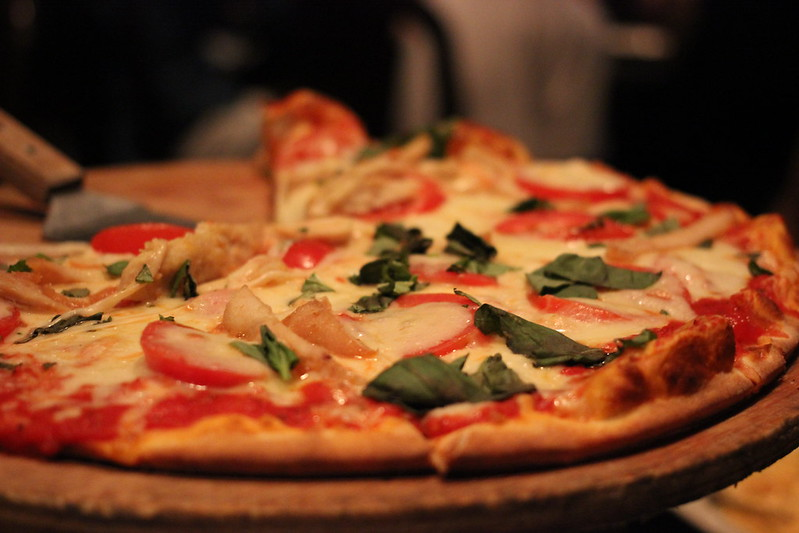
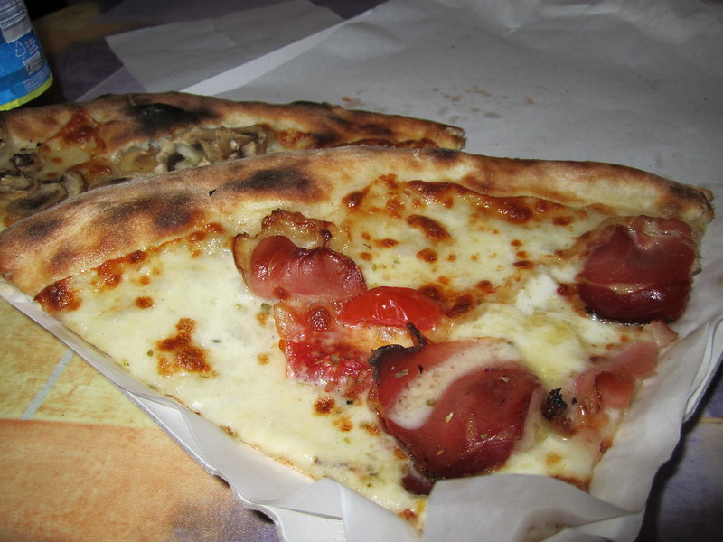
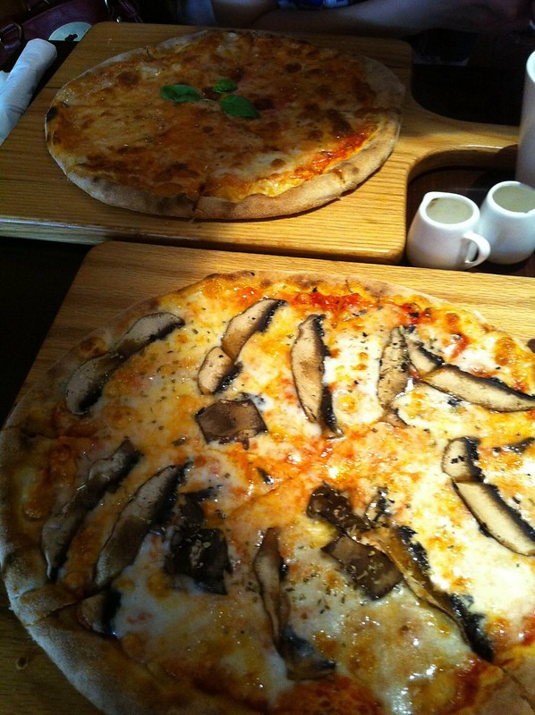
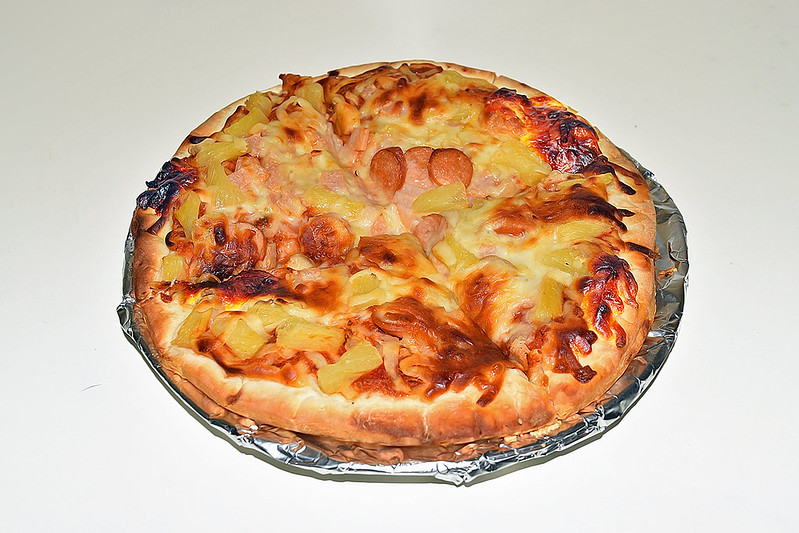

# Analysis of 1000 pizza related images

## Size Estimation

* Currently, we chose url_c (see below for more url types)
    * url_o, original is way too big, 100 images take up over 200 MB
    * url_c, medium (800, 800)
        * is relatively compact
        * can still eye-ball good pictures vs. bad
* With url_c, 1000 pizza images take up around 160 MB of space, in jpeg

#### Unanswer Questions:
```
1. Images downloaded through url_c still seem to have different shapes, may need to be padded or warppped to the same shape before processing

2. Ultimately, images will be represented in numpy arrays, can we fit all training data in memory?
    a. If not, we need to dynamically load training

3. Is there a limit to how many images we can collect? The limit can come from both flickr's API and the dataset.
```

Download Images through urls
```python
download_images.download_image_by_url('output/pizza_urlc_1000', urls)
```

different url types
* url_c: URL of medium 800, 800 on longest size image
* url_m: URL of small, medium size image
* url_n: URL of small, 320 on longest side size image
* url_o: URL of original size image
* url_q: URL of large square 150x150 size image
* url_s: URL of small suqare 75x75 size image
* url_sq: URL of square size image
* url_t: URL of thumbnail, 100 on longest side size image


## The distribution of number of views
* do differentiate
* However, variation can be HUGE \
\
Meidan: 2092.5, Mean: 6544.471

```python
# retrieve data
from retrieve_data import get_urls, download_images
urls, views = get_urls.get_urls_by_tag('pizza', max_count=1000, url_type='url_c')

# generate statistics
import statistics
statistics.median(views),statistics.mean(views) 

# display the figure
import matplotlib.pyplot as plt
import seaborn as sns

sns.distplot(views)
# save the figure
sns.distplot(views).get_figure().savefig('view_diff_in_1000_pizza_images.png')
```

## Photos with high number of views look better than those

#### Some top-viewed pizza images
\
\
\

#### Some low-view pizza images
\
\


```python
# top rated ones
for i in range(len(views)):
    if views[i] > 70000:
        print(urls[i])

# low rated ones
for i in range(len(views)):
    if views[i] < 1000:
        print(urls[i])
```

