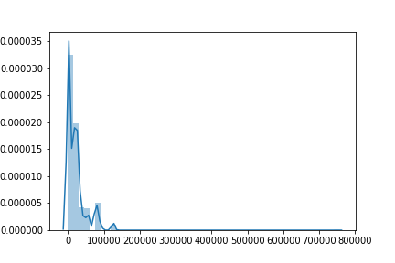
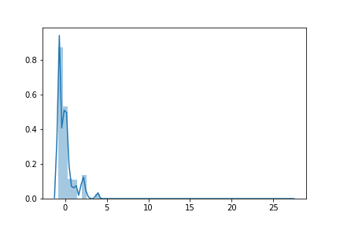
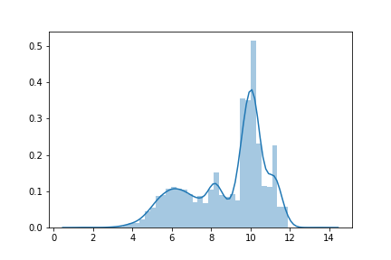
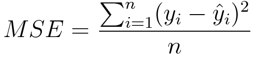

# First model for the pizza likelihood estimator

## Overall Concerns

Problems that may lead to poor fit on `training` data:

* MSE on Raw number of views may not be good enough

## Design chioces

Image comes with different sizes

* url_c offsers all images within size of 800 * 800, but images may have different aspect ratio and thus various width

* `resize`, scale image to desired size, vs. `fill_zero`.

* Chose `resize` for now because that is more common

* But resize deletes aspect ratio difference and thus may affect how "good" a picture looks

What to predict?

`Percentage of view count`

* "This photo will receive more views than 94% pizza photos"

* Percentage fixed the distribution skewness while maintaining some meaning to the user. Users don't actually want to know number of views their photos will get, they want to know that their photos are going to popoular, liked by other people. This percentage predicts a popularity estimation.

* Many other methods to reduce skewness have been tried. But 1. skewness is still very severe, and 2. they strip away the actual meaning of the prediction.

View distribution in percentage

View Distribution in raw counts

View Distribution in standarized raw counts

View Distribution in log counts

View Distribution in standarized log counts

## Data

Train & Validation: 80/20 split of `pizza_urlc_10000`

Loading Data

* Load one batch at a time to maintain minimal memory usage

## Loss Function

Mean Squared Error on `percentage of the view counts`

## Architecture
