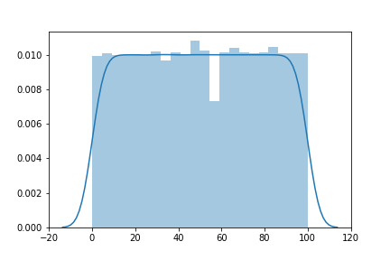

# First model for the pizza likelihood estimator

## Overall Concerns

Problems that may lead to poor fit on `training` data:

* MSE on Raw number of views may not be good enough

## Design chioces

Image comes with different sizes

* url_c offsers all images within size of 800 * 800, but images may have different aspect ratio and thus various width

* `resize`, scale image to desired size, vs. `fill_zero`.

* Chose `resize` for now because that is more common

* But resize deletes aspect ratio difference and thus may affect how "good" a picture looks

What to predict?

`Percentage of view count`

* "This photo will receive more views than 94% pizza photos"

* Percentage fixed the distribution skewness while maintaining some meaning to the user. Users don't actually want to know number of views their photos will get, they want to know that their photos are going to popoular, liked by other people. This percentage predicts a popularity estimation.

* Many other methods to reduce skewness have been tried. But 1. skewness is still very severe, and 2. they strip away the actual meaning of the prediction.

```Python
from scipy import stats

# contains duplicated calculation, but since this is only run once for entire data collection, this is fine
# this is the cleanest calculation
[stats.percentileofscore(retrieved_views, i, 'rank') for i in retrieved_views]

# some sample outputs
print(retrieved_views[:5])     # [79345, 9890, 30888, 35527, 45208]
print(percentage_views[:5])    # [94.66, 42.63, 80.74, 83.9, 85.49]

# to produce the figures below
sns.distplot(percentage_views)
```

### All figures below are generated using 10,000 pizza images dataset

View distribution in percentage



View Distribution in raw counts


View Distribution in standarized raw counts


View Distribution in log counts


View Distribution in standarized log counts


## Data

Train & Validation: 80/20 split of `pizza_urlc_10000`

Loading Data

* Load one batch at a time to maintain minimal memory usage

## Loss Function

Mean Squared Error on `percentage of the view counts`


## Architecture

### Dark Net

* Smaller Simple Net with a single downsample in the first layer

* Took ~ 4 Hours and with batch size of 16, occupied almost all GPU memory.

* Improved Accuracy Substantially

```
train avg l1 diff from ground truth: 0.0790
test avg l1 diff from ground truth: 0.0864
```

Loss Decrease:

```
Epoch 0
[1,   100] loss: 0.386
[1,   200] loss: 0.301
[1,   300] loss: 0.278
[1,   400] loss: 0.256
[1,   500] loss: 0.245
Epoch 1
[2,   100] loss: 0.234
[2,   200] loss: 0.223
[2,   300] loss: 0.217
[2,   400] loss: 0.212
[2,   500] loss: 0.212
Epoch 2
[3,   100] loss: 0.198
[3,   200] loss: 0.192
[3,   300] loss: 0.198
[3,   400] loss: 0.196
[3,   500] loss: 0.181
```


* Other details:

    * Removed dropout from original simpleNet. Dropout seems to make the program hard to train

    * Small batch size of 4 also made it hard to train the network. Thus, it is trained on batch size of 16


### Simple Net

* 12 layer network designed for CIFAR-10 with image size of (3, 32, 32). Achieved over 86% test accuracy on CIFAR-10 when trained on my personal computer.

Problem: `CANNOT RUN`. SimpleNet tries to maintain the image size throughout the first 10ish layers, and then downsamples through maxpool the size down.

Because our input image is (3, 800, 800), Pytorch would have to spend a lot of memory to save intermediate states, which will be used by backprop later. It turns out to too much for the GPU to handle

Following error occurred even with batch size of 4 :(
```
RuntimeError: CUDA out of memory. Tried to allocate 1.22 GiB (GPU 0; 7.92 GiB total capacity; 5.53 GiB already allocated; 878.31 MiB free; 475.00 KiB cached)
```

### Multi-Layer Convolution

Architecture
```Python

nn.Sequential(

    # layer 1
    nn.Conv2d(3, 10, kernel_size=5, stride=1, padding=1),
    nn.BatchNorm2d(10),
    nn.MaxPool2d(3, stride=3),
    nn.ReLU(),

    # layer 2
    nn.Conv2d(10, 20, kernel_size=5, stride=1, padding=1),
    nn.BatchNorm2d(20),
    nn.MaxPool2d(5, stride=5),
    nn.ReLU(),

    # layer 3
    nn.Conv2d(20, 20, kernel_size=5, stride=1, padding=1),
    nn.BatchNorm2d(20),
    nn.MaxPool2d(5, stride=5),
    nn.ReLU(),

)

# followed by fc of 20 * 10 * 10
```

Performance Updates:
(After changing loss function to l1_loss and run the model for 30 epoches)
```
# NOT BAD!!! Definitely better than any random guess
train accu:  0.1094
test accu:  0.1134
```

IT IS ACTUALLY DOING SOMETHING!!! loss is decreasing!
```
[1,   100] loss: 0.193
[1,   200] loss: 0.168
[1,   300] loss: 0.152
[1,   400] loss: 0.127
[1,   500] loss: 0.118
Epoch 1
[2,   100] loss: 0.109
[2,   200] loss: 0.103
[2,   300] loss: 0.091
[2,   400] loss: 0.092
[2,   500] loss: 0.087
Epoch 2
[3,   100] loss: 0.086
[3,   200] loss: 0.080
[3,   300] loss: 0.091
[3,   400] loss: 0.079
[3,   500] loss: 0.077
Epoch 3
[4,   100] loss: 0.071
[4,   200] loss: 0.071
[4,   300] loss: 0.073
[4,   400] loss: 0.070
[4,   500] loss: 0.068
Epoch 4
[5,   100] loss: 0.073
[5,   200] loss: 0.066
[5,   300] loss: 0.064
[5,   400] loss: 0.068
[5,   500] loss: 0.061
Epoch 5
[6,   100] loss: 0.061
[6,   200] loss: 0.064
[6,   300] loss: 0.058
[6,   400] loss: 0.062
[6,   500] loss: 0.060
Epoch 6
[7,   100] loss: 0.056
[7,   200] loss: 0.057
```
 #### Concern:
 
* Squared loss is actually inaccurate since .5^2 = .25

   * Solution: use torch.nn.L1Loss so that loss is NOT squared

``` 
Small try with l1 loss:

[1,   100] loss: 0.353
[1,   200] loss: 0.315
[1,   300] loss: 0.290
[1,   400] loss: 0.279
[1,   500] loss: 0.263
```

* GPU still has a lot of space. Let's get deeper models

* 16 batch size may be small. But

```
In general: Larger batch sizes result in faster progress in training, but don't always converge as fast. Smaller batch sizes train slower, but can converge faster. It's definitely problem dependent.
```


### Single Fully Connected Layer with 800 x 800 x 3 params

* Even with slowest learning rate, loss is exploding

* Possibly Due to large number of parameters in the layers

```
iter 0 loss 0.3730698823928833
iter 1 loss 4.005115509033203
iter 2 loss 61.52337646484375
iter 3 loss 888.7198486328125
iter 4 loss 13382.470703125
iter 5 loss 224991.359375
iter 6 loss 4239744.0
iter 7 loss 74775160.0
iter 8 loss 1077042688.0
iter 9 loss 12655656960.0
iter 10 loss 164620009472.0
iter 11 loss 2449315987456.0
iter 12 loss 41244558360576.0
iter 13 loss 436946786582528.0
iter 14 loss 4855126594420736.0

# lr was 10-6 and float point precision only allows 10-7
```

Solution

* Build CNN with many downsampling layers in the early stage -> bring down number of params. Follow advice from the post (https://ai.stackexchange.com/questions/3938/how-to-handle-images-of-large-sizes-in-cnn)

* If all other measures failed, Use smaller images

Other details:

* Even though dynamically loading in samples, the training speed is not too terrible

* During setup, didn't realize torch comes with cuda, so you only need an up-to-date nvidia driver to make torch run on GPU (AMAZING)

* batch size was 16 and memory consumption was 1 or 2 GB. This should be fair enough to train on a larger CNN, so other memory space will be left to CNN parameters

